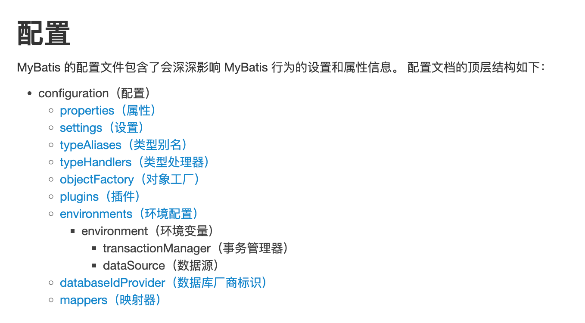
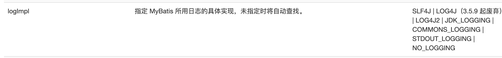

[https://spring.io/projects/spring-framework#overview][官网]
[https://repo.spring.io/ui/native/release/org/springframework/spring][版本]
[https://github.com/spring-projects/spring-framework][github]
[https://mvnrepository.com/search?q=spring][maven]

[https://www.docs4dev.com/docs/zh/spring-framework][Spring Framework 中文文档]


###自动装填

> @Resource和Autowired的区别
>都是用来自动装配的，都可以放在属性字段上
>@Autowired通过byname的方式实现，而且必须要求这个对象存在
>@Resource默认通过byname的方式实现，如果找不到名字，则通过byType实现，如果都找不到则报错


```
        <!--指定扫描的包，在这个包下的注解就会生效-->
        <context:component-scan base-package="com.com.demo" />
        <context:annotation-config />
```

***


##mybatis-springboot
[https://mybatis.org/mybatis-3/zh/][mybatis]

 


                                  
mybatis-config.xml  （SqlSessionFactory）
SqlSessionFactoryBuilder -> SqlSessionFactory -> SqlSession -> SQL Mapper -> end
一旦创建了SqlSessionFactoryBuilder，就不再需要它了。

SqlSessionFactory一旦创建就应该在运行的期间一直存在，没有任何理由丢弃它或重新创建
另一个实例。 单例模式或者静态单例模式

**SqlSession**
连接到连接池的请求！
SqlSession的实例不是线程安全的，因此是不能被共享的，所以它最佳的请求作用域是请求和方法作用域。
用完之后需要赶紧关闭，否则资源被占用！

|标题|标题|标题|
|:---|:---:|---:|
|居左测试文本|居中测试文本|居右测试文本|
|居左测试文本1|居中测试文本2|居右测试文本3|
|居左测试文本11|居中测试文本22|居右测试文本33|
|居左测试文本111|居中测试文本222|居右测试文本333|


 


